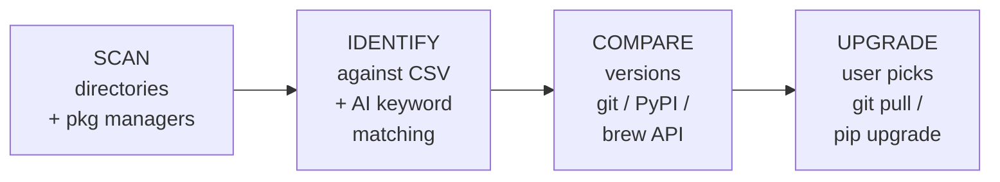

<p align="center">
  
  
  
  
  
</p>

<h1 align="center">AI Updater</h1>
<p align="center"><strong>A Claude Code skill that finds and upgrades every AI open-source project on your machine.</strong></p>

<p align="center">
  <a href="README.zh.md">中文</a>
</p>

---

## Install

```bash
# 1. Clone anywhere
git clone https://github.com/176336109/AI-Updater.git ~/.claude/skills/ai-updater

# 2. Install Python dependencies
pip install -r ~/.claude/skills/ai-updater/requirements.txt

# 3. Register the slash command (so you can type /ai-updater)
mkdir -p ~/.claude/commands
cp ~/.claude/skills/ai-updater/.claude/commands/ai-updater.md ~/.claude/commands/ai-updater.md
```

That's it. Now open Claude Code and run:

```
/ai-updater
```

The skill scans your machine, finds every AI project, and asks you which ones to upgrade.

<p align="center"><em>Clone once. Run the slash command whenever you feel like updating.</em></p>

## What `/ai-updater` does

Type `/ai-updater` in Claude Code and the skill:

```
============================================================
| AI Updater  --  One-click upgrade for your AI toolkit
|==========================================================|
|  Windows Mode                                          |
|==========================================================|
Loaded 69 preset projects (projects.csv)

[Scan] Directory scan (Windows)
  -> D:\AIwkspace
    v ComfyUI  (a1b2c3d)  [D:\AIwkspace\ComfyUI]

[Scan] pip (Python)
  -- Smart Discovery --
  ! [found] torch (2.12.0)  -> 2.12.1
  ! [found] transformers (5.9.0) -> 5.12.1
  ! [found] gradio (6.15.2)  -> 6.19.0
    pip found 9 AI-related packages

[Scan] winget (Windows)
  - [found] Ollama (0.30.3)

[Preset] from projects.csv -- 1 project
[Discovered] AI keyword match -- 10 projects

  Updatable: 6   Latest: 5   Total: 11

Which ones do you want to upgrade?
  [1,3,5] pick  [1-5] range  [all] everything  [p] preset only  [d] discovered only  [q] quit
>
```

You pick the numbers, the skill does the rest: `git pull`, `pip install --upgrade`, `brew upgrade`, `winget upgrade`.

## Why a Claude Code skill?

You already live in Claude Code. Your Python environments, your AI projects, your workflows — it's all there. Instead of opening another terminal and remembering package names, you just type `/ai-updater` and Claude Code handles the scanning, version comparison, and upgrading.

- **You're already here.** No context-switching to another tool.
- **Claude Code can reach everything.** pip, npm, brew, winget, conda, git — all the package managers you use.
- **Claude Code can explain.** If an update fails, the error is right there in your session. Ask Claude Code to fix it.

## Features

### Preset matching + Smart discovery

| Layer | How it works |
|---|---|
| **Preset (69 projects)** | Scans directories for git repos. Matches against `projects.csv`. Checks pip/brew/winget/conda for linked packages. |
| **Smart discovery** | Iterates ALL installed packages across pip/npm/brew/winget/conda. Matches against AI keywords: torch, transformers, langchain, gradio, whisper, chroma, ollama, deepseek, grok... |

### Upgrade engine

- **Git projects**: `git stash` -> `git pull` -> post-update commands
- **pip**: `pip install --upgrade` with PyPI version comparison
- **brew**: `brew upgrade`
- **winget**: `winget upgrade`
- **conda / npm**: detected and reported

### Interactive

After the scan, **you** decide:
- `p` — upgrade preset projects only
- `d` — upgrade discovered packages only
- `1,3,5` — pick specific items
- `all` — upgrade everything

### Cross-platform

| Platform | Package managers |
|---|---|
| **Windows** | pip · npm · winget · conda |
| **macOS** | pip · npm · brew · conda |

## Standalone mode

Don't want to use the skill inside Claude Code? Run it directly:

```bash
python ai_updater.py                  # scan + interactive upgrade
python ai_updater.py --scan-only      # scan only
python ai_updater.py --update-all     # auto-upgrade everything
python ai_updater.py --config my.yaml # custom config
```

## Add your own projects

Open `projects.csv` in Excel / WPS / Google Sheets. Append a row:

| name | category | git_url | dir_signature | website | update_method | platforms |
|---|---|---|---|---|---|---|
| MyProject | llm-tools | github.com/my/project | myproject/main.py | https://... | git_pull | win\|mac |

The skill reads it on every run. No code changes needed.

## Preset projects (69, 5 categories)

| Category | Count | Examples |
|---|---|---|
| Image Generation | 15 | ComfyUI, AUTOMATIC1111, Forge, Fooocus, InvokeAI, SwarmUI, FaceFusion |
| LLM Tools | 20 | Ollama, Open WebUI, text-gen-webui, llama.cpp, vLLM, GPT4All, Jan |
| AI Frameworks | 16 | Langflow, Dify, Flowise, AutoGPT, CrewAI, MetaGPT, LangChain, LlamaIndex |
| Voice AI | 9 | Whisper.cpp, Coqui TTS, Bark, RVC-WebUI, GPT-SoVITS, ChatTTS |
| Vector DB | 9 | Chroma, Qdrant, Milvus, Weaviate, PGVector, LanceDB |

## How it works



## Requirements

- Python 3.8+
- Git (for git-based projects)
- `pip install -r requirements.txt`

## FAQ

**Q: Will it break my local changes?**  
A: No. Git projects get `git stash` before `git pull`. pip packages are safely upgraded.

**Q: Can I ignore certain projects?**  
A: Yes. Add their names to `ignore_projects` in `config.yaml`.

**Q: What if a project isn't in the 69 presets?**  
A: Smart discovery catches AI-related packages from your package managers automatically. You can also add it to `projects.csv`.

## License

MIT — see [LICENSE](LICENSE).
