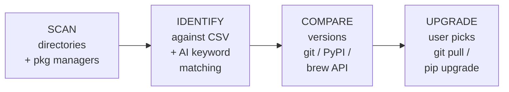

<p align="center">
  
  
  
  
  
</p>

<h1 align="center">AI Updater</h1>
<p align="center"><strong>A Claude Code skill that finds and upgrades every AI open-source project on your machine.</strong></p>

<p align="center">
  <a href="README.zh.md">中文</a>
</p>

---

## The problem

You installed ComfyUI six months ago via `git clone`. Then Ollama via `winget`. Then Stable Diffusion WebUI, then a dozen Python packages — `torch`, `transformers`, `gradio`, `langchain`... Then a bunch of Claude Code skills from GitHub. Some are git repos you forgot about. Some are pip packages scattered across venvs. Some are winget installs you never check.

**What's outdated? What's even installed? You have no idea.**

Opening each project folder one by one, running `git pull`, checking `pip list` against PyPI, checking `winget upgrade` — that's a whole afternoon you don't have.

## The solution

`/ai-updater` scans your entire machine in one pass — directories AND package managers — finds every AI-related project (even the ones you forgot), checks what's outdated, and lets you upgrade with a single command.

```
/ai-updater
```

That's it. Claude Code does the rest.

## Demo

```
============================================================
| AI Updater  --  One-click upgrade for your AI toolkit
|==========================================================|
Loaded 229 preset projects (projects.csv)

[Scan] Directory scan (Windows)
  -> D:\AIwkspace
    v ComfyUI  (a1b2c3d)  [D:\AIwkspace\ComfyUI]

[Scan] pip (Python)
  -- Smart Discovery --
  ! [found] torch (2.12.0)  -> 2.12.1
  ! [found] transformers (5.9.0) -> 5.12.1
  ! [found] gradio (6.15.2)  -> 6.19.0
    pip found 9 AI-related packages

[Scan] winget (Windows)
  - [found] Ollama (0.30.3)
  - [found] Figma (126.2.7)

[Preset] from projects.csv -- 1 project
[Discovered] AI keyword match -- 11 projects

  Updatable: 7   Latest: 5   Total: 12

Which ones do you want to upgrade?
  [1,3,5] pick  [1-5] range  [all] everything  [p] preset only  [d] discovered only  [q] quit
>
```

## Install

```bash
git clone https://github.com/176336109/AI-Updater.git
cd AI-Updater

# Run the installer (auto-detects your AI tools)
bash install.sh        # macOS / Linux
# install.bat           # Windows

# Install Python dependencies
pip install -r requirements.txt
```

The installer copies the skill to the right config directories:

| Tool | Installed to |
|---|---|
| **Claude Code** | `~/.claude/skills/ai-updater/` + `~/.claude/commands/` |
| **Codex** | `~/.codex/skills/ai-updater/` + `~/.codex/commands/` |
| **Cursor** | `~/.cursor/commands/` |

Then open your AI coding tool and type `/ai-updater`.

## Why a Claude Code Skill

You already live in Claude Code. Instead of switching to another terminal, just type `/ai-updater` and Claude Code handles everything — scanning, comparing, upgrading. If an update fails, the error is right there in your session. Ask Claude Code to fix it.

## Features

### Preset matching + Smart discovery

| Layer | How it works |
|---|---|
| **Preset (229 projects)** | Scans directories for git repos, matches against `projects.csv`. Checks pip/brew/winget/conda for linked packages. |
| **Smart discovery** | Iterates ALL installed packages across pip/npm/brew/winget/conda. Matches AI keywords — torch, transformers, langchain, gradio, whisper, chroma, ollama, figma, deepseek, grok... |

### Upgrade engine

- **Git projects**: `git stash` -> `git pull` -> post-update commands
- **pip**: `pip install --upgrade` with PyPI version comparison
- **brew**: `brew upgrade`
- **winget**: `winget upgrade`
- **conda / npm**: detected and reported

### Interactive selection

After scanning, **you** decide:
- `p` — preset projects only
- `d` — discovered packages only
- `1,3,5` — specific items
- `all` — upgrade everything
- `q` — quit

### Cross-platform

| Platform | Package managers |
|---|---|
| **Windows** | pip · npm · winget · conda |
| **macOS** | pip · npm · brew · conda |

## Standalone mode

Don't want to use the skill inside Claude Code? Run it directly:

```bash
python ai_updater.py                  # scan + interactive upgrade
python ai_updater.py --scan-only      # scan only
python ai_updater.py --update-all     # auto-upgrade everything
python ai_updater.py --config my.yaml # custom config
```

## Add your own projects

Open `projects.csv` in Excel / WPS / Google Sheets. Append a row:

| name | category | git_url | dir_signature | website | update_method | platforms |
|---|---|---|---|---|---|---|
| MyProject | llm-tools | github.com/my/project | myproject/main.py | https://... | git_pull | win\|mac |

The skill reads it on every run. No code changes needed.

## Preset projects (229, 11 categories)

| Category | Count | Examples |
|---|---|---|
| Image Generation | 25 | ComfyUI, AUTOMATIC1111, Forge, Fooocus, InvokeAI, SwarmUI |
| LLM Tools | 29 | Ollama, Open WebUI, text-gen-webui, llama.cpp, vLLM, GPT4All |
| AI Frameworks | 27 | Langflow, Dify, Flowise, AutoGPT, CrewAI, LangChain |
| Voice AI | 17 | Whisper.cpp, Coqui TTS, Bark, RVC-WebUI, ChatTTS |
| Vector DB | 12 | Chroma, Qdrant, Milvus, Weaviate, PGVector |
| AI Coding | 3 | Aider, Continue, Cline |
| AI Memory | 51 | Mem0, Letta, Cognee, Graphiti, MemoryOS |
| RAG Frameworks | 5 | RAGFlow, Quivr, Verba, Cognita, AgentGPT |
| Code Graph | 8 | codegraph, GitNexus, code2prompt |
| Token Optimization | 35 | LLMLingua, Headroom, RouteLLM, tiktoken, Langfuse |
| Design Tools | 17 | Open Design, screenshot-to-code, oh-my-mermaid, penpot, remotion |

## How it works



## FAQ

**Q: Will it break my local changes?**  
A: No. `git stash` before every pull. pip packages are safely upgraded.

**Q: Can I ignore certain projects?**  
A: Yes. Add their names to `ignore_projects` in `config.yaml`.

**Q: What if a project isn't in the 229 presets?**  
A: Smart discovery catches AI-related packages from your package managers automatically. Or add it to `projects.csv`.

**Q: Does it work on Linux?**  
A: Not yet. PRs welcome.

## License

MIT — see [LICENSE](LICENSE).
