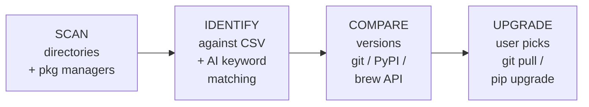

<p align="center">
  
  
  
  
</p>

<h1 align="center">🤖 AI Updater</h1>
<p align="center"><strong>One command to find and upgrade every AI open-source project on your machine.</strong></p>

<p align="center">
  <a href="README.zh.md">中文</a>
</p>

---

## The problem

You've installed a dozen AI projects — ComfyUI, Ollama, Open WebUI, Langflow, Stable Diffusion WebUI, text-generation-webui… — and keeping track of updates across git repos, pip packages, brew casks, and winget installs is a nightmare. You don't even remember what you installed.

## The solution

`ai-updater` scans your entire machine — directories AND package managers — finds every AI-related project (even ones you forgot about), checks if updates are available, and upgrades them with a single command.

```bash
pip install -r requirements.txt
python ai_updater.py
```

## Demo

```
[扫描] 目录扫描 (Windows)
  -> D:\AIwkspace
    v ComfyUI  (a1b2c3d)  [D:\AIwkspace\ComfyUI]
    v Open WebUI  (v0.3.23)  [D:\AIwkspace\open-webui]

[扫描] pip (Python)
  -- 智能发现 --
  ! [发现] gradio (6.15.2)  -> 6.19.0
  ! [发现] torch (2.12.0)   -> 2.12.1
  ! [发现] transformers (5.9.0) -> 5.12.1
    pip 智能发现 9 个 AI 相关包

[扫描] winget (Windows)
  - [发现] Ollama (0.30.3)
    winget 智能发现 1 个 AI 相关包

[预设项目] 来自 projects.csv — 共 2 个         ← matched from database
[智能发现] AI 关键词匹配 — 共 10 个              ← auto-discovered

  可更新: 6   已最新: 6   总计: 12

你想升级哪些？
  【1,3,5】 选序号  【1-5】 范围  【all】 全部  【p】 仅预设  【d】 仅发现  【q】 退出
> 
```

## Features

### Dual-layer detection

| Layer | How it works |
|---|---|
| **Preset matching** (69 projects) | Scans your directories for git repos + signature files. Matches against `projects.csv`. Detects pip/brew/winget/conda packages linked to known projects. |
| **Smart discovery** | Iterates through ALL installed packages (pip, npm, brew, winget, conda) and matches against AI keywords — torch, transformers, langchain, gradio, whisper, chroma, ollama, grok, deepseek… |

### Smart upgrade engine

- **Git projects**: `git stash` (protects local changes) -> `git pull` -> post-update commands (pip install requirements)
- **pip packages**: `pip install --upgrade` with PyPI version comparison
- **Homebrew**: `brew upgrade`
- **winget**: `winget upgrade`
- **conda/npm**: detected and reported

### Interactive selection

After scanning, you choose:
- `p` — upgrade preset projects only (safe, from your CSV database)
- `d` — upgrade discovered packages only
- `1,3,5` — pick specific items
- `all` — upgrade everything

### Cross-platform

| Platform | Package managers |
|---|---|
| **Windows** | pip · npm · winget · conda |
| **macOS** | pip · npm · brew · conda |

## Quick Start

```bash
# 1. Clone
git clone https://github.com/YOU/ai-updater.git
cd ai-updater

# 2. Install dependencies
pip install -r requirements.txt

# 3. Run
python ai_updater.py

# First run auto-generates config.yaml.
# Edit it to add your own scan paths.
```

## Add your own projects

Open `projects.csv` in **Excel / WPS / Google Sheets** — it's a spreadsheet! Append a row:

| name | category | git_url | dir_signature | website | update_method | platforms |
|---|---|---|---|---|---|---|
| MyProject | llm-tools | github.com/my/project | myproject/main.py | https://... | git_pull | win\|mac |

The script reads it on every run. No code changes needed.

## Preset projects (69, 5 categories)

| Category | Count | Examples |
|---|---|---|
| 🎨 Image Generation | 15 | ComfyUI, AUTOMATIC1111, Forge, Fooocus, InvokeAI, SwarmUI, FaceFusion |
| 🧠 LLM Tools | 20 | Ollama, Open WebUI, text-gen-webui, llama.cpp, vLLM, GPT4All, Jan |
| 🔧 AI Frameworks | 16 | Langflow, Dify, Flowise, AutoGPT, CrewAI, MetaGPT, LangChain, LlamaIndex |
| 🎤 Voice AI | 9 | Whisper.cpp, Coqui TTS, Bark, RVC-WebUI, GPT-SoVITS, ChatTTS |
| 🗂️ Vector DB | 9 | Chroma, Qdrant, Milvus, Weaviate, PGVector, LanceDB |

## How it works



## Requirements

- Python 3.8+
- Git (for git-based projects)
- `pip install -r requirements.txt`

## FAQ

**Q: Will it break my local changes?**  
A: No. Git projects get `git stash` before pull. pip packages are safely upgraded. Everything is reversible.

**Q: Can I ignore certain projects?**  
A: Yes. Add their names to `ignore_projects` in `config.yaml`.

**Q: What if a project isn't in the 69 presets?**  
A: Smart discovery catches AI-related packages from your package managers automatically. You can also add it to `projects.csv`.

**Q: Does it work on Linux?**  
A: Not yet — pull requests welcome!

## License

MIT — see [LICENSE](LICENSE).
