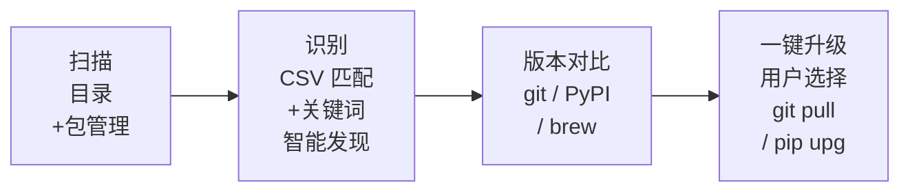

<p align="center">
  
  
  
  
  
</p>

<h1 align="center">AI Updater</h1>
<p align="center"><strong>Claude Code Skill：一键找到并升级你电脑上所有的 AI 开源项目。</strong></p>

<p align="center">
  <a href="README.md">English</a>
</p>

---

## 安装

```bash
git clone https://github.com/176336109/AI-Updater.git
cd AI-Updater

# 运行安装器（自动检测你的 AI 工具）
bash install.sh        # macOS / Linux
# install.bat           # Windows

# 安装 Python 依赖
pip install -r requirements.txt
```

安装器会自动把 skill 复制到对应工具的配置目录：

| 工具 | 安装位置 |
|---|---|
| **Claude Code** | `~/.claude/skills/ai-updater/` + `~/.claude/commands/` |
| **Codex** | `~/.codex/skills/ai-updater/` + `~/.codex/commands/` |
| **Cursor** | `~/.cursor/commands/` |

搞定。打开你的 AI 编程工具，输入：

```
/ai-updater
```

Skill 会扫描你的整台电脑，找到所有 AI 项目，然后问你升级哪些。

<p align="center"><em>Clone 一次。之后随时敲斜杠命令升级。</em></p>

## `/ai-updater` 做了什么

在 Claude Code 里敲 `/ai-updater`，Skill 会：

```
============================================================
| AI Updater  --  一键更新你的 AI 开源工具箱
|==========================================================|
|  Windows 模式                                          |
|==========================================================|
已加载 69 个预设项目（projects.csv）

[扫描] 目录扫描 (Windows)
  -> D:\AIwkspace
    v ComfyUI  (a1b2c3d)  [D:\AIwkspace\ComfyUI]

[扫描] pip (Python)
  -- 智能发现 --
  ! [发现] torch (2.12.0)  -> 2.12.1
  ! [发现] transformers (5.9.0) -> 5.12.1
  ! [发现] gradio (6.15.2)  -> 6.19.0
    pip 智能发现 9 个 AI 相关包

[扫描] winget (Windows)
  - [发现] Ollama (0.30.3)

[预设项目] 来自 projects.csv -- 1 个
[智能发现] AI 关键词匹配 -- 10 个

  可更新: 6   已最新: 5   总计: 11

你想升级哪些？
  [1,3,5] 选序号  [1-5] 范围  [all] 全部  [p] 仅预设  [d] 仅发现  [q] 退出
>
```

你选好序号，Skill 帮你执行：`git pull`、`pip install --upgrade`、`brew upgrade`、`winget upgrade`。

## 为什么做成 Claude Code Skill？

你本来就泡在 Claude Code 里。Python 环境、AI 项目、工作流，全在这。与其再开一个终端、回想包名，不如直接敲 `/ai-updater`，Claude Code 帮你扫描、比对、升级。

- **不用切工具。** 你已经在 Claude Code 里了。
- **Claude Code 什么都能调。** pip、npm、brew、winget、conda、git——所有包管理器。
- **Claude Code 能解释。** 某个项目更新失败了？错误信息就在会话里，直接让 Claude Code 帮你修。

## 核心能力

### 预设匹配 + 智能发现

| 层 | 原理 |
|---|---|
| **预设匹配（69 项目）** | 扫描目录找 git 仓库，与 `projects.csv` 匹配。同时检查 pip/brew/winget/conda 中关联的包。 |
| **智能发现** | 遍历 pip/npm/brew/winget/conda 中**所有已装包**，用 AI 关键词匹配——torch、transformers、langchain、gradio、whisper、chroma、ollama、deepseek、grok…… |

### 更新引擎

- **Git 项目**：`git stash` -> `git pull` -> 更新后命令
- **pip**：`pip install --upgrade` + PyPI 版本比对
- **brew**：`brew upgrade`
- **winget**：`winget upgrade`
- **conda / npm**：检测并报告

### 你说了算

扫描结束后，**你**决定升哪些：
- `p` — 只升预设项目
- `d` — 只升智能发现的包
- `1,3,5` — 手动挑序号
- `all` — 全部一起升

### 跨平台

| 平台 | 包管理器 |
|---|---|
| **Windows** | pip · npm · winget · conda |
| **macOS** | pip · npm · brew · conda |

## 独立模式

不想在 Claude Code 里用？直接跑脚本：

```bash
python ai_updater.py                  # 扫描 + 交互升级
python ai_updater.py --scan-only      # 只扫描
python ai_updater.py --update-all     # 自动全部升级
python ai_updater.py --config my.yaml # 指定配置
```

## 添加你自己的项目

用 Excel / WPS / Google Sheets 打开 `projects.csv`，在末尾新增一行：

| name | category | git_url | dir_signature | website | update_method | platforms |
|---|---|---|---|---|---|---|
| 我的项目 | llm-tools | github.com/my/project | myproject/main.py | https://... | git_pull | win\|mac |

Skill 每次运行自动读取，无需改代码。

## 预设项目（69 项，5 大类）

| 类别 | 数量 | 示例 |
|---|---|---|
| 图像生成 | 25 | ComfyUI、AUTOMATIC1111、Forge、Fooocus、InvokeAI、SwarmUI、FaceFusion、StabilityMatrix、Real-ESRGAN、AnimateDiff、OneTrainer |
| LLM 工具 | 29 | Ollama、Open WebUI、text-gen-webui、llama.cpp、vLLM、GPT4All、Jan、LiteLLM、SGLang、Tabby、NextChat、Chatbox |
| AI 框架 | 27 | Langflow、Dify、Flowise、AutoGPT、CrewAI、MetaGPT、LangChain、LlamaIndex、LangGraph、AutoGen、Haystack、smolagents |
| 语音 AI | 17 | Whisper.cpp、Coqui TTS、Bark、RVC-WebUI、GPT-SoVITS、ChatTTS、OpenAI-Whisper、faster-whisper、WhisperX、AudioCraft、F5-TTS |
| 向量数据库 | 12 | Chroma、Qdrant、Milvus、Weaviate、PGVector、LanceDB、FAISS、Vespa |
| AI 编程助手 | 3 | Aider、Continue、Cline |
| AI 记忆 | 4 | Mem0、Letta、Cognee、Graphiti |
| RAG 框架 | 5 | RAGFlow、Quivr、Verba、Cognita、AgentGPT |

## 原理解析



## 依赖

- Python 3.8+
- Git（用于 git 项目）
- `pip install -r requirements.txt`

## 常见问题

**Q: 会弄坏我的本地修改吗？**  
A: 不会。Git 项目在 pull 前自动 `git stash`。pip 包安全升级。

**Q: 能忽略某些项目吗？**  
A: 可以。在 `config.yaml` 的 `ignore_projects` 里加上项目名。

**Q: 69 个预设里没有我的项目怎么办？**  
A: 智能发现会自动从包管理器抓出来。你也可以直接加到 `projects.csv`。

## License

MIT — 详见 [LICENSE](LICENSE)。
